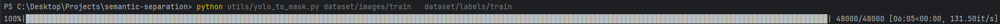
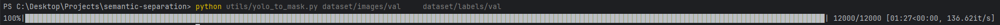
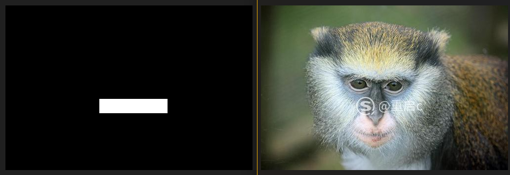
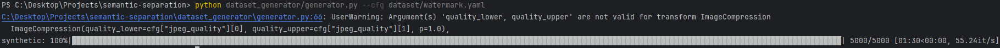

# semantic-separation
Solving the task of semantic separation of combined images using artificial neural networks

# Dataset preparation:
* python utils/yolo_to_mask.py dataset/images/train dataset/labels/train

* python utils/yolo_to_mask.py dataset/images/val dataset/labels/val

And we get:

* python dataset_generator/generator.py --cfg dataset/watermark.yaml

And we get:

# Train:
* python train_base.py 
* python train_improved.py

# Statistics
* python plot_metrics.py <path_to_statistics_in_same_dir>.csv

# API:
* docker-compose up -d --build
* Swagger UI: http://127.0.0.1:8000/docs

# Python 3.11